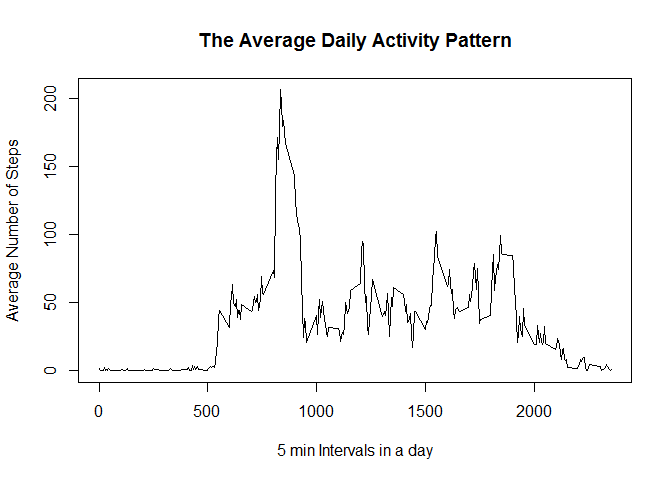
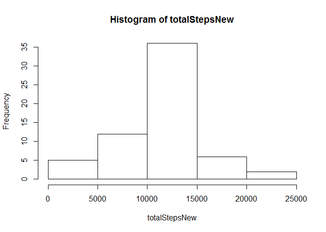

# Reproducible Research: Peer Assessment 1


## Loading and preprocessing the data

The data can be retrieved here: https://d396qusza40orc.cloudfront.net/repdata%2Fdata%2Factivity.zip

**Loading the data**

```r
unzip("activity.zip")
activity <- read.csv("activity.csv")
```
**Initial data visualization**

```r
summary(activity)
```

```
##      steps                date          interval     
##  Min.   :  0.00   2012-10-01:  288   Min.   :   0.0  
##  1st Qu.:  0.00   2012-10-02:  288   1st Qu.: 588.8  
##  Median :  0.00   2012-10-03:  288   Median :1177.5  
##  Mean   : 37.38   2012-10-04:  288   Mean   :1177.5  
##  3rd Qu.: 12.00   2012-10-05:  288   3rd Qu.:1766.2  
##  Max.   :806.00   2012-10-06:  288   Max.   :2355.0  
##  NA's   :2304     (Other)   :15840
```

**Data processing and transformation**

```r
mydata = as.data.frame(activity[complete.cases(activity), ])
summary(mydata)
```

```
##      steps                date          interval     
##  Min.   :  0.00   2012-10-02:  288   Min.   :   0.0  
##  1st Qu.:  0.00   2012-10-03:  288   1st Qu.: 588.8  
##  Median :  0.00   2012-10-04:  288   Median :1177.5  
##  Mean   : 37.38   2012-10-05:  288   Mean   :1177.5  
##  3rd Qu.: 12.00   2012-10-06:  288   3rd Qu.:1766.2  
##  Max.   :806.00   2012-10-07:  288   Max.   :2355.0  
##                   (Other)   :13536
```

## What is mean total number of steps taken per day?
1. Make a histogram of the total number of steps taken each day


```r
totalSteps = tapply(mydata$steps, mydata$date, sum)
hist(totalSteps)
```

<!-- -->

2. Calculate and report the mean and median total number of steps taken per day


```r
mean(totalSteps, na.rm = TRUE)
```

```
## [1] 10766.19
```


```r
median(totalSteps, na.rm = TRUE)
```

```
## [1] 10765
```

## What is the average daily activity pattern?
1. Make a time series plot (i.e. type = "l") of the 5-minute interval (x-axis) and the average number of steps taken, averaged across all days (y-axis)

```r
avgDailyPattern = aggregate(mydata$steps, by = list(mydata$interval), FUN = mean)
plot(avgDailyPattern[, 1], avgDailyPattern[, 2], type = "l", 
     xlab = "5 min Intervals in a day", 
     ylab = "Average Number of Steps", 
     main = "The Average Daily Activity Pattern")
```

<!-- -->
2. Which 5-minute interval, on average across all the days in the dataset, contains the maximum number of steps?

```r
avgDailyPattern[which.max(avgDailyPattern[, 2]), 1]
```

```
## [1] 835
```

## Imputing missing values
1. Calculate and report the total number of missing values in the dataset (i.e. the total number of rows with NAs)

```r
sum(!complete.cases(activity))
```

```
## [1] 2304
```

2. Devise a strategy for filling in all of the missing values in the dataset. The strategy does not need to be sophisticated. For example, you could use the mean/median for that day, or the mean for that 5-minute interval, etc.

**Means for the 5-minute intervals as fillers for missing values will be used.**

3. Create a new dataset that is equal to the original dataset but with the missing data filled in.

```r
newdata = activity
len1 = nrow(newdata)
len2 = nrow(avgDailyPattern)
for (i in 1:len1) {
  if (is.na(newdata$steps[i])) {
    for (j in 1:len2) {
      if (newdata$interval[i] == avgDailyPattern[j, 1]) {
        newdata$steps[i] = avgDailyPattern[j, 2]
      }
    } 
  }    
}
summary(newdata)
```

```
##      steps                date          interval     
##  Min.   :  0.00   2012-10-01:  288   Min.   :   0.0  
##  1st Qu.:  0.00   2012-10-02:  288   1st Qu.: 588.8  
##  Median :  0.00   2012-10-03:  288   Median :1177.5  
##  Mean   : 37.38   2012-10-04:  288   Mean   :1177.5  
##  3rd Qu.: 27.00   2012-10-05:  288   3rd Qu.:1766.2  
##  Max.   :806.00   2012-10-06:  288   Max.   :2355.0  
##                   (Other)   :15840
```

4. Make a histogram of the total number of steps taken each day and Calculate and report the mean and median total number of steps taken per day. Do these values differ from the estimates from the first part of the assignment? 

```r
totalStepsNew = tapply(newdata$steps, newdata$date, sum)
hist(totalStepsNew)
```

<!-- -->


```r
mean(totalStepsNew, na.rm = TRUE)
```

```
## [1] 10766.19
```


```r
median(totalStepsNew, na.rm = TRUE)
```

```
## [1] 10766.19
```

What is the impact of imputing missing data on the estimates of the total daily number of steps?

Mean total number of steps taken per day : 10766.19

This is the same as that of the original dataset with missing value removed. 

Median total number of steps taken per day : 10766.19  

This is different from the median calculated from the original dataset. 

This is due to the addition of 2304 values with the mean of the 5-minute interval from the original dataset. 

**The mean does not change, and the median moves towards to the mean value.**

## Are there differences in activity patterns between weekdays and weekends?
1. Create a new factor variable in the dataset with two levels -- "weekday" and "weekend" indicating whether a given date is a weekday or weekend day.

```r
mydata$weekday = TRUE
weekday = weekdays(as.POSIXct(mydata$date, format = "%Y-%m-%d" ))
for (i in 1:length(weekday)) {
  if (weekday[i] == "Saturday" | weekday[i] == "Sunday") {
    mydata$weekday[i] = FALSE
  }
}
dataWeekday = mydata[which(mydata$weekday == TRUE), ]
dataWeekend = mydata[which(mydata$weekday == FALSE), ]

avgWeekdayPattern = aggregate(dataWeekday$steps, 
                               by = list(dataWeekday$interval), 
                               FUN = mean)
names(avgWeekdayPattern) = c("interval", "steps")
avgWeekdayPattern$dayTag = "weekday"
avgWeekendPattern = aggregate(dataWeekend$steps, 
                              by = list(dataWeekend$interval), 
                              FUN = mean)
names(avgWeekendPattern)= c("interval", "steps")
avgWeekendPattern$dayTag = "weekend"

avgPattern = rbind(avgWeekdayPattern, avgWeekendPattern)
```

2. Make a panel plot containing a time series plot (i.e. type = "l") of the 5-minute interval (x-axis) and the average number of steps taken, averaged across all weekday days or weekend days (y-axis).

```r
library(lattice)
xyplot(steps ~ interval | dayTag, data = avgPattern, 
       type = "l", layout = c(1, 2))
```

<!-- -->

**Graph analysis**
Looking at the graphs, there are differences in activity patterns between weekdays and weekends. 

During the weekdays, morning activities start earlier than the weekends, and there is a clear peak in the mornings, but less activity in the afternoons. 

In weekends, morning activities are much less than weekdays, but there are more steady activities last for a whole day.
